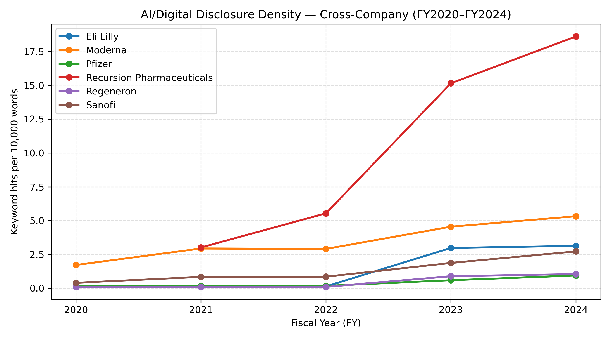
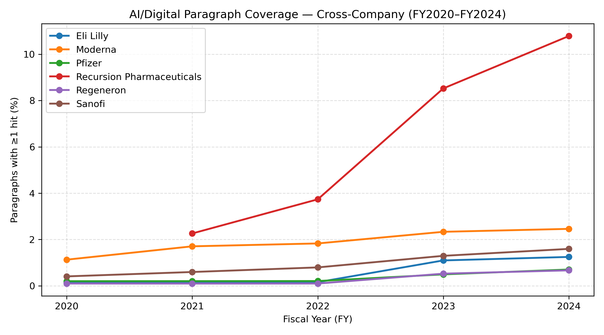
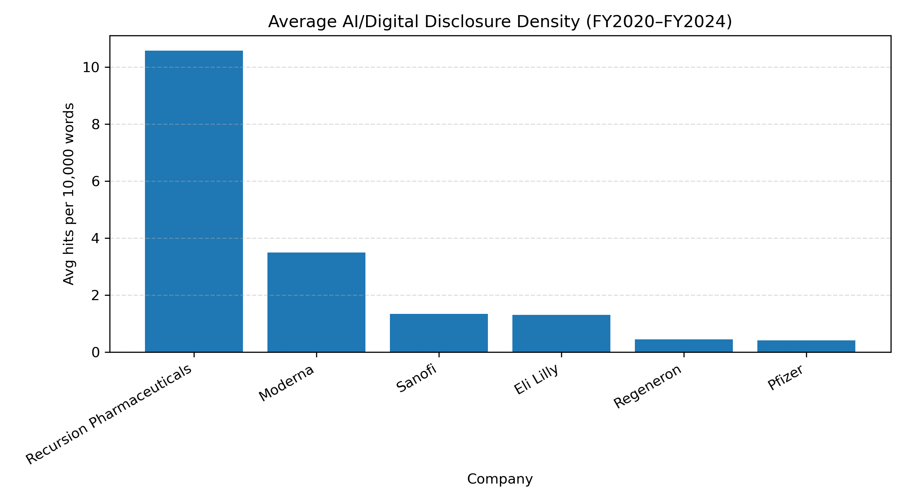
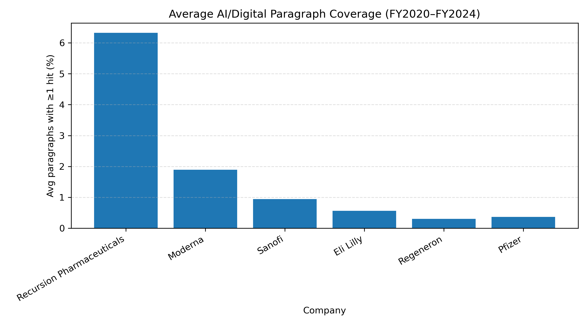

# Biopharm-10K-AI-Digital-Disclosure-Analysis

This repository presents a **text analytics project** examining how selected **biopharmaceutical companies** disclose **AI and digital transformation** topics in annual filings (FY2020–FY2024) using public data from the **U.S. SEC EDGAR** system.  
The project applies **Python-based document retrieval, keyword extraction, and visualization** to quantify disclosure intensity and compare cross-company trends.

---

## Objectives
- Retrieve annual filing HTML from **SEC EDGAR** (10-K / 20-F) with polite access (User-Agent + rate limiting)
- Extract filing text and generate **stable paragraph units** for coverage analysis
- Detect a **small + stable keyword set** related to AI/digital themes
- Compute disclosure metrics:
  - **Keyword density** (hits per 10,000 words) — *full text*
  - **Paragraph coverage** (% paragraphs with ≥1 hit) — *finer paragraphs*
- Compare disclosure trends across companies and years (panel + ranking + keyword heatmap)

---

## Modules
| # | Title | Focus |
|:-:|--------|--------|
| **01** | Pfizer 10-K AI/Digital Disclosure | Company-level trend (FY2020–FY2024) |
| **02** | Regeneron 10-K AI/Digital Disclosure | Company-level trend (FY2020–FY2024) |
| **03** | Eli Lilly 10-K AI/Digital Disclosure | Company-level trend (FY2020–FY2024) |
| **04** | Sanofi 20-F AI/Digital Disclosure | Foreign issuer annual report (FY2020–FY2024) |
| **05** | Moderna 10-K AI/Digital Disclosure | Company-level trend (FY2020–FY2024) |
| **06** | Recursion 10-K AI/Digital Disclosure | Company-level trend (FY2021–FY2024; IPO in 2021) |
| **07** | Cross-Company Comparison Panel | Panel table + rankings + keyword heatmap (FY2020–FY2024) |

---

## Keyword Set (Small + Stable)
The analysis uses a compact keyword list designed for interpretability and auditability:

- artificial intelligence  
- machine learning  
- deep learning  
- generative ai  
- advanced analytics  
- data platform  
- real-world evidence  
- real-world data  
- predictive  
- digital transformation  
- automation  
- decision support  
- **AI token** (AI / A.I. / A. I.) — strict standalone only (avoids OpenAI/GenAI substrings)

---

## Data Source
- **Source:** SEC EDGAR Company Submissions JSON + Filing Archives  
- **Publisher:** U.S. Securities and Exchange Commission (SEC)  
- **Access Method:**  
  - Company submissions: `https://data.sec.gov/submissions/CIK##########.json`  
  - Filing archive HTML: `https://www.sec.gov/Archives/edgar/data/...`  

---

## Tools
- **Python 3.10**  
- **Environment:** Jupyter Notebook  
- **Libraries:** Pandas, Requests, Matplotlib  

---

## Visualization Summary

### Module 7 — Cross-company density trend (FY2020–FY2024)

### Module 7 — Cross-company paragraph coverage trend (FY2020–FY2024)

### Module 7 — Average density ranking

### Module 7 — Average coverage ranking

### Module 7 — Keyword heatmap (sum across FY)

---

## Author
**Dr. Hanjing Wu**  
Ph.D. in Bioengineering | M.S. Candidate in Computer Science, Syracuse University  

📧 Email: hwu188@syr.edu  
🌐 GitHub: [https://github.com/huansha2002](https://github.com/huansha2002)

---

*This repository is shared for educational and research demonstration purposes only.*  
*Unauthorized reproduction or commercial use is prohibited.*
